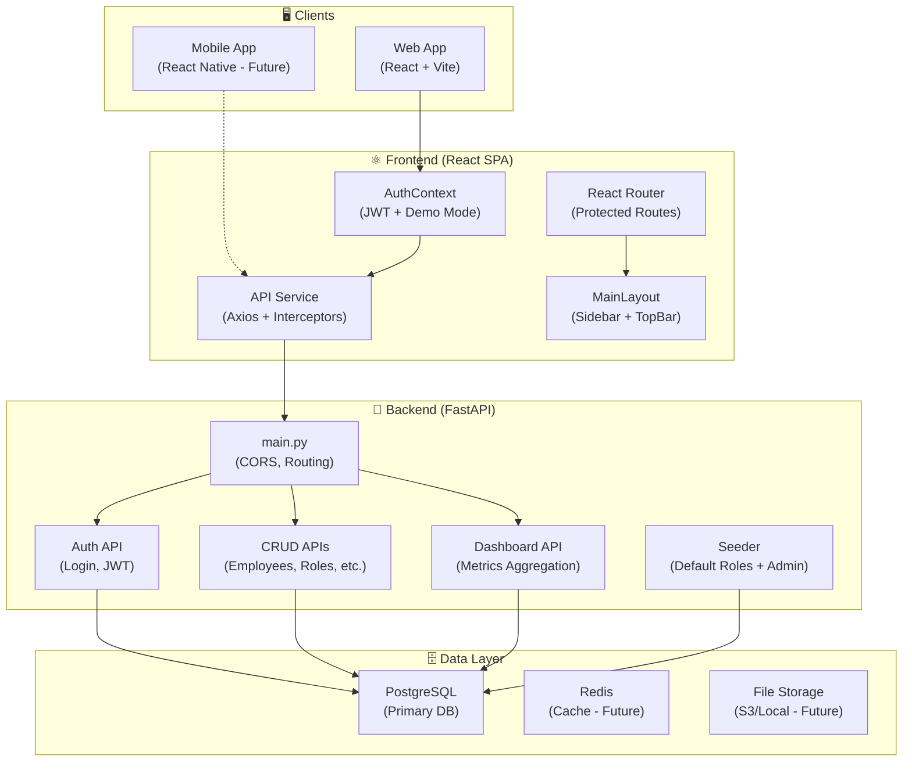
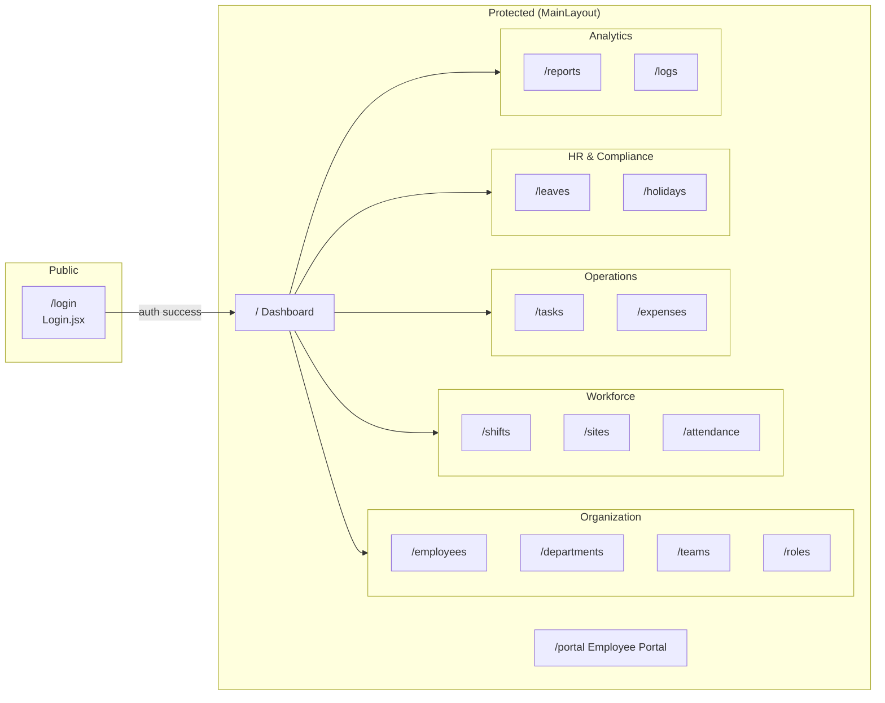
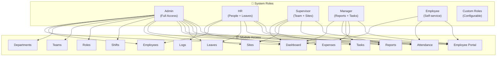
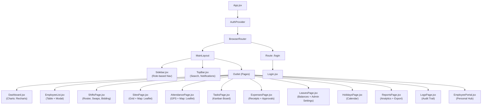
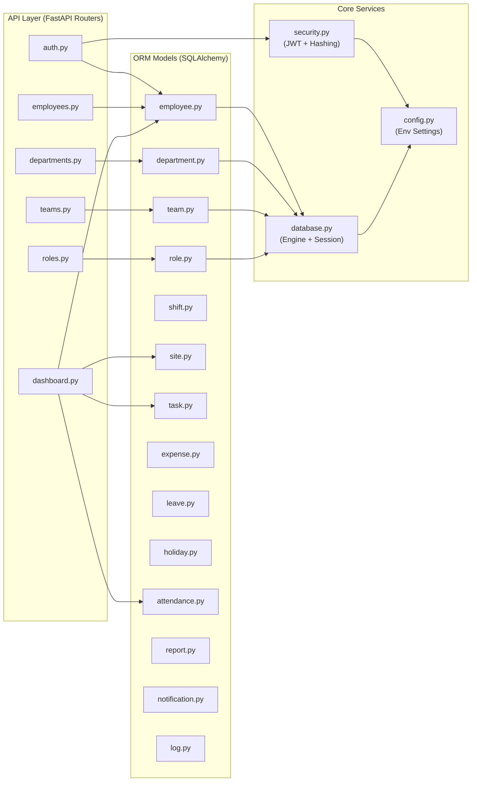

# FEMS — Project Architecture (Mermaid Diagrams)

## 1. High-Level System Architecture

---

## 2. Frontend Routing & Page Map

---

## 3. Backend Data Model (ERD)

```mermaid
erDiagram
    ROLES ||--o{ EMPLOYEES : "has"
    DEPARTMENTS ||--o{ EMPLOYEES : "belongs to"
    TEAMS ||--o{ EMPLOYEES : "member of"
    EMPLOYEES ||--o| EMPLOYEES : "supervised by"

    EMPLOYEES ||--o{ EMPLOYEE_SKILLS : "has"
    SKILLS ||--o{ EMPLOYEE_SKILLS : "linked"

    EMPLOYEES ||--o{ ATTENDANCE : "records"
    EMPLOYEES ||--o{ LOCATION_TRACKING : "tracked"
    EMPLOYEES ||--o{ GEOFENCE_EVENTS : "triggers"

    SHIFT_TYPES ||--o{ SHIFTS : "defines"
    EMPLOYEES ||--o{ SHIFTS : "assigned"
    EMPLOYEES ||--o{ SHIFT_SWAP_REQUESTS : "requests"
    EMPLOYEES ||--o{ SHIFT_BIDS : "bids on"

    SITES ||--o{ SITE_ASSIGNMENTS : "has"
    EMPLOYEES ||--o{ SITE_ASSIGNMENTS : "assigned to"
    SITES ||--o{ SITE_ISSUES : "reported at"
    SITES ||--o{ SITE_ATTENDANCE : "checked in"

    EMPLOYEES ||--o{ TASKS : "assigned"
    TASKS ||--o{ TASK_PROGRESS : "updates"
    TASKS ||--o{ MATERIAL_USAGE : "uses"

    EMPLOYEES ||--o{ EXPENSES : "submits"
    EXPENSES ||--o{ EXPENSE_APPROVALS : "reviewed"

    LEAVE_TYPES ||--o{ LEAVES : "categorized"
    EMPLOYEES ||--o{ LEAVES : "applies"
    EMPLOYEES ||--o{ LEAVE_BALANCES : "has"

    EMPLOYEES ||--o{ NOTIFICATIONS : "receives"
    NOTIFICATIONS ||--o{ NOTIFICATION_RECIPIENTS : "sent to"

    EMPLOYEES ||--o{ REPORTS : "generates"
    REPORTS ||--o{ REPORT_SCHEDULES : "scheduled"

    ROLES {
        int id PK
        string name
        string permissions
    }
    EMPLOYEES {
        int id PK
        string employee_id UK
        string name
        string email UK
        int role_id FK
        int department_id FK
        int team_id FK
        int supervisor_id FK
        string status
        string employee_type
    }
    DEPARTMENTS {
        int id PK
        string name
        int manager_id FK
        string status
    }
    TEAMS {
        int id PK
        string name
        int department_id FK
        int lead_id FK
    }
    SHIFT_TYPES {
        int id PK
        string name
        time start_time
        time end_time
        int grace_minutes
        string ot_policy
    }
    SITES {
        int id PK
        string site_id UK
        string name
        float lat
        float long
        int geofence_radius
        string status
    }
    ATTENDANCE {
        int id PK
        int employee_id FK
        datetime check_in
        datetime check_out
        float lat
        float long
    }
    TASKS {
        int id PK
        string title
        int assigned_to FK
        string status
        string priority
    }
    EXPENSES {
        int id PK
        int employee_id FK
        float amount
        string category
        string status
    }
    LEAVE_TYPES {
        int id PK
        string name
        int annual_quota
    }
    LEAVES {
        int id PK
        int employee_id FK
        int leave_type_id FK
        date start_date
        date end_date
        string status
    }
```

---

## 4. Role-Based Access Control (RBAC)

---

## 5. Frontend Component Tree

---

## 6. Backend Module Map

